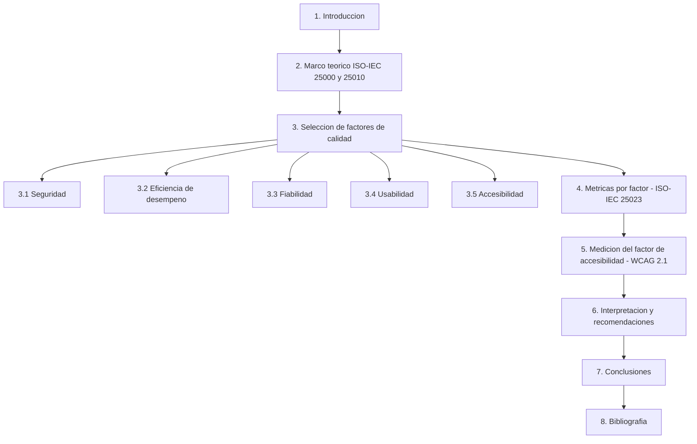
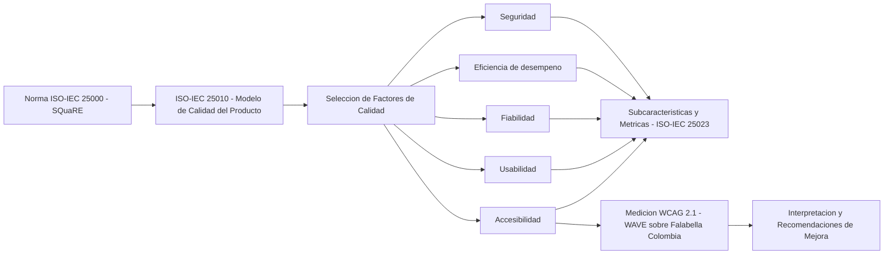

# 🧩 Modelo de Calidad de Software basado en ISO/IEC 25010

### *Aplicado al Comercio Electrónico: Seguridad, Eficiencia, Fiabilidad, Usabilidad y Accesibilidad*

**Asignatura: Procesos en Ingeniería del Software · Actividad de Laboratorio: Diseño y Desarrollo de un Modelo de Calidad**

**[Contexto](#-contexto-y-alcance) • [Contenido](#-contenido-del-repositorio) • [Herramientas](#-herramientas-utilizadas) • [Estructura](#-estructura-del-documento) • [Factores de calidad](#-factores-de-calidad-evaluados) • [Autor](#-autor)**

---

## 📋 Tabla de Contenidos

- [🎯 Contexto y Alcance](#-contexto-y-alcance)
- [📁 Contenido del Repositorio](#-contenido-del-repositorio)
- [🧰 Herramientas Utilizadas](#-herramientas-utilizadas)
- [📐 Estructura del Documento](#-estructura-del-documento)
- [🔁 Flujo de Derivación del Modelo](#-flujo-de-derivación-del-modelo)
- [🏭 Factores de Calidad Evaluados](#-factores-de-calidad-evaluados)
- [♿ Medición de Accesibilidad](#-medición-de-accesibilidad)
- [📚 Técnicas y Estándares Aplicados](#-técnicas-y-estándares-aplicados)
- [📄 Cómo Consultar el Documento](#-cómo-consultar-el-documento)
- [✅ Contenido Verificable del Documento](#-contenido-verificable-del-documento)
- [📝 Nota](#-nota)
- [👥 Autor](#-autor)

---

## 🎯 Contexto y Alcance

Este repositorio contiene el trabajo desarrollado para la asignatura **Procesos en Ingeniería del Software**, correspondiente a la **Actividad de Laboratorio: Diseño y desarrollo de un modelo de calidad**.

El trabajo diseña un **modelo de calidad de software** fundamentado en la familia de normas **ISO/IEC 25000 (SQuaRE)** y en el modelo de calidad del producto **ISO/IEC 25010**, particularizado para el dominio del **comercio electrónico**. Incluye además la medición del factor de accesibilidad sobre un sitio real (**Falabella Colombia**) mediante evaluación automatizada con **WCAG 2.1**.

> **Estándar:** ISO/IEC 25010 (modelo de calidad del producto), sobre la base de ISO/IEC 25000 (SQuaRE).
> **Dominio:** comercio electrónico.
> **Alcance:** cinco factores de calidad — Seguridad, Eficiencia de desempeño, Fiabilidad, Usabilidad y Accesibilidad — con métricas ISO/IEC 25023 y medición real de accesibilidad.

### 🌟 ¿Qué aporta este documento?

- 🎯 **Modelo de calidad acotado** a cinco factores clave del comercio electrónico: Seguridad, Eficiencia de desempeño, Fiabilidad, Usabilidad y Accesibilidad.
- 🧾 **Desarrollo de subcaracterísticas y métricas** por factor, siguiendo ISO/IEC 25023.
- ♿ **Medición real de accesibilidad** con WCAG 2.1 sobre la página de inicio de Falabella Colombia.
- 📊 **Interpretación de resultados** y recomendaciones de mejora derivadas de la medición.

---

## 📁 Contenido del Repositorio

<table align="center">
  <tr><th>Elemento</th><th>Descripción</th></tr>
  <tr><td><code>Desarrollo_Proyecto_Alejandro_De_Mendoza_Tovar.pdf</code></td><td>📘 Documento final: análisis del dominio, marco ISO/IEC 25010, desarrollo de los cinco factores de calidad con sus métricas, y medición del factor de accesibilidad con su interpretación</td></tr>
  <tr><td><code>README.md</code></td><td>📄 Este documento</td></tr>
  <tr><td><code>LICENSE</code></td><td>⚖️ Licencia MIT</td></tr>
  <tr><td><code>.gitignore</code></td><td>🚫 Mantiene en local los documentos editables (<code>.docx</code>, <code>.doc</code>), la carpeta de la actividad y los archivos temporales de Office</td></tr>
</table>

> ℹ️ El repositorio versiona **únicamente el PDF final**. Los enunciados, las versiones editables en Word (`.docx`) y cualquier material de la actividad quedan excluidos vía `.gitignore` y permanecen solo en local.

---

## 🧰 Herramientas Utilizadas

| Componente | Uso |
|:---|:---|
| **ISO/IEC 25000 (SQuaRE)** | Marco general de la familia de normas de calidad de software |
| **ISO/IEC 25010** | Modelo de calidad del producto y selección de factores |
| **ISO/IEC 25023** | Subcaracterísticas y métricas de medición por factor |
| **WCAG 2.1** | Pautas de accesibilidad (niveles A y AA) usadas como referencia |
| **WAVE (WebAIM)** | Herramienta empleada para la medición efectiva de accesibilidad |
| **TAW** | Herramienta de referencia; no completó el análisis (sitio tipo SPA) |
| **Mermaid** | Diagramas de estructura y de derivación de este README |

---

## 📐 Estructura del Documento

---

## 🔁 Flujo de Derivación del Modelo

---

## 🏭 Factores de Calidad Evaluados

| Factor | Descripción |
|:---|:---|
| **Seguridad** | Confidencialidad, integridad, no repudio, autenticidad y responsabilidad |
| **Eficiencia de desempeño** | Comportamiento temporal, utilización de recursos y capacidad |
| **Fiabilidad** | Madurez, disponibilidad, tolerancia a fallos y recuperabilidad |
| **Usabilidad** | Reconocibilidad de la adecuación, aprendizabilidad, operabilidad, protección contra errores de usuario y estética de la interfaz |
| **Accesibilidad** | Principios WCAG 2.1: perceptible, operable, comprensible y robusto |

---

## ♿ Medición de Accesibilidad

La evaluación del factor de accesibilidad se realizó sobre la página de inicio de **Falabella Colombia**, tomando como referencia las pautas **WCAG 2.1 (niveles A y AA)**:

- **WAVE (WebAIM)** → herramienta empleada para la medición efectiva (evalúa el DOM renderizado).
- **TAW** → herramienta de referencia; no completó el análisis por tratarse de una aplicación de página única (SPA).

---

## 📚 Técnicas y Estándares Aplicados

| Elemento | Aplicación |
|:---|:---|
| **ISO/IEC 25000 (SQuaRE)** | Marco general de la familia de normas de calidad |
| **ISO/IEC 25010** | Selección y definición de los cinco factores de calidad |
| **ISO/IEC 25023** | Subcaracterísticas y métricas asociadas a cada factor |
| **WCAG 2.1** | Referencia normativa para la evaluación de accesibilidad |
| **WAVE (WebAIM)** | Medición automatizada sobre el sitio real evaluado |
| **TAW** | Herramienta de contraste (sin resultado completo por ser SPA) |

---

## 📄 Cómo Consultar el Documento

1. Descargar o abrir `Desarrollo_Proyecto_Alejandro_De_Mendoza_Tovar.pdf` desde este repositorio.
2. Seguir la estructura descrita en [📐 Estructura del Documento](#-estructura-del-documento): de la introducción a la bibliografía.
3. Revisar el desarrollo de cada **factor de calidad** (sección 3) con sus subcaracterísticas y métricas.
4. Consultar la **medición de accesibilidad** (sección 5) y su **interpretación y recomendaciones** (sección 6).

---

## ✅ Contenido Verificable del Documento

<b>🔎 Ver elementos que incluye el PDF</b>

| Elemento | Sección | Incluido |
|:---|:---|:---:|
| Introducción | 1 | ✔ |
| Marco teórico ISO/IEC 25000 y 25010 | 2 | ✔ |
| Factor: Seguridad | 3.1 | ✔ |
| Factor: Eficiencia de desempeño | 3.2 | ✔ |
| Factor: Fiabilidad | 3.3 | ✔ |
| Factor: Usabilidad | 3.4 | ✔ |
| Factor: Accesibilidad | 3.5 | ✔ |
| Métricas por factor (ISO/IEC 25023) | 4 | ✔ |
| Medición WCAG 2.1 con WAVE (Falabella Colombia) | 5 | ✔ |
| Interpretación y recomendaciones de mejora | 6 | ✔ |
| Conclusiones | 7 | ✔ |
| Bibliografía | 8 | ✔ |

---

## 📝 Nota

Este documento corresponde a una **actividad académica**. La medición del factor de accesibilidad se realizó con herramientas automatizadas (WAVE) sobre el sitio real de Falabella Colombia con fines exclusivamente formativos, sin relación oficial con la empresa ni carácter de auditoría certificada.

---

## 👥 Autor

Trabajo desarrollado en el marco de la asignatura **Procesos en Ingeniería del Software**.

| Autor | Perfil |
|:---:|:---:|
| **Alejandro De Mendoza** |  |

---

### 🧩 *Un software de calidad no se declara, se mide*

**Procesos en Ingeniería del Software · Modelo de Calidad ISO/IEC 25010 aplicado al Comercio Electrónico**

