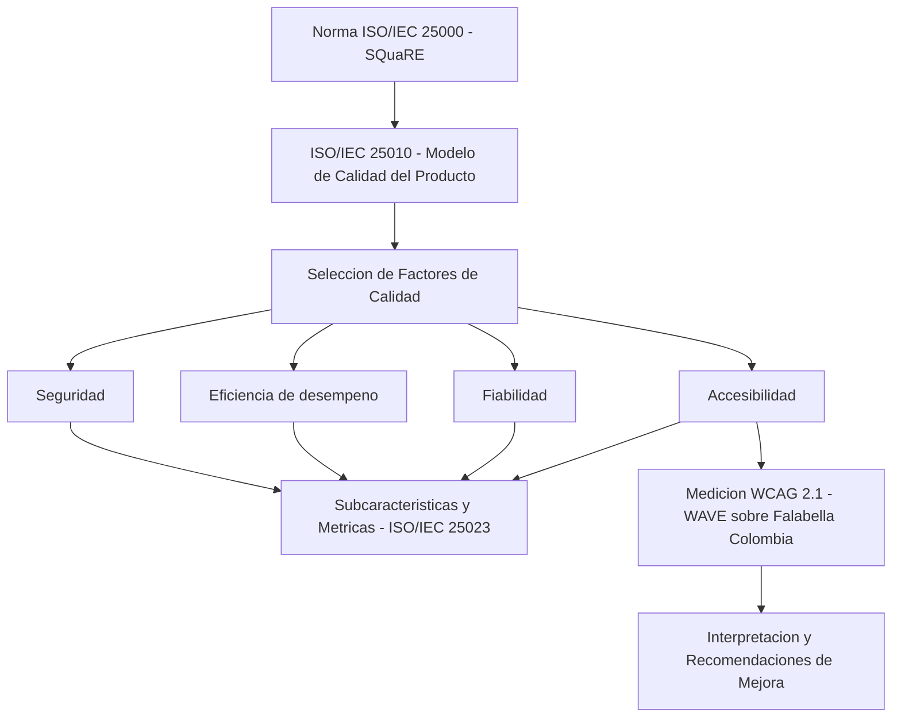

# Procesos en Ingeniería del Software - Diseño y Desarrollo de un Modelo de Calidad basado en ISO/IEC 25010 aplicado al Comercio Electrónico

---

Este repositorio contiene el trabajo desarrollado para la asignatura **Procesos en Ingeniería del Software**, correspondiente a la **Actividad de Laboratorio: Diseño y desarrollo de un modelo de calidad**. El trabajo diseña un modelo de calidad de software fundamentado en la familia de normas **ISO/IEC 25000 (SQuaRE)** y en el modelo de calidad del producto **ISO/IEC 25010**, particularizado para el dominio del **comercio electrónico**, e incluye la medición del factor de accesibilidad sobre un sitio real (Falabella Colombia) mediante evaluación automatizada con **WCAG 2.1**.

## Contenido del repositorio:
- `Desarrollo_Proyecto_Alejandro_De_Mendoza_Tovar.pdf` → Documento final del trabajo: análisis del dominio, marco ISO/IEC 25010, desarrollo de los cuatro factores de calidad con sus métricas, y medición del factor de accesibilidad con su interpretación.

## Arquitectura

## Factores de calidad evaluados:
- **Seguridad** → confidencialidad, integridad, no repudio, autenticidad y responsabilidad.
- **Eficiencia de desempeño** → comportamiento temporal, utilización de recursos y capacidad.
- **Fiabilidad** → madurez, disponibilidad, tolerancia a fallos y recuperabilidad.
- **Accesibilidad** → principios WCAG 2.1 (perceptible, operable, comprensible y robusto).

## Medición de accesibilidad:
La evaluación del factor de accesibilidad se realizó sobre la página de inicio de **Falabella Colombia** tomando como referencia las pautas **WCAG 2.1 (niveles A y AA)**:
- **WAVE (WebAIM)** → herramienta empleada para la medición efectiva (evalúa el DOM renderizado).
- **TAW** → herramienta de referencia; no completó el análisis por tratarse de una aplicación de página única (SPA).

## Autor:
Este trabajo fue desarrollado en el marco de la asignatura **Procesos en Ingeniería del Software**.
- ***Alejandro De Mendoza*** – [Perfil GitHub](https://github.com/AlejoTechEngineer)
